<h1 align="center"> :kiss:  Repo das Minas  :lipstick:  :high_heel:  :nail_care: </h1> 

###  :construction:  Em contrução!  :construction:

### Mulheres na tecnologia

 :apple: Durante nossa formação na  <a href="https://www.betrybe.com/" target="_blank">
      
      Trybe
   </a>, ficou ainda mais evidenciado que, nós mulheres, temos necessidades, obrigações e tarefas completamente diferentes das dos homens. Muitas são mães com jornadas triplas de trabalho, muitas acumulam várias tarefas na lida com o cotidiano, mesmo não sendo mãe

 :apple: E como cumprir todos os comprimissos com nossa carreira? A reposta que chegamos é : NOS AJUDANDO! 
 Criando um ambiente seguro no meio desse ambiente prevalentemente masculino (por pouco tempo :wink: ) e acessível para que todas nós brilhemos :sparkles:!
  Esse ambiente foi criado para nos auxiliarmos!! Montaremos nosso :octocat: GitHub campeão :trophy: que nos ajudará a encontrar a empresa dos nossos sonhos :heart_eyes: !!! 

### Objetivo

Auxiliar as mulheres a montarem um Github campeão disponibilizando templates de README e Profile

###   Sintam-se à vontade para contribuir  

 ### Sumário
 
 #### :feet: Passo-a-passos :feet:
 

<a href="https://github.com/onyrius/repo-das-mina/blob/f226203649794a35a1b7307b719031b63149c189/como-copiar-repo.md">Como copiar os templates?</a>  
      
<a href="https://www.youtube.com/watch?v=TsaLQAetPLU&list=PLhkO7OMKgT_rqwGYldqcFxyN4yjFgmDh8&index=4&ab_channel=RafaellaBallerini">Passo a passo de como criar o GitHub Profile - Video 20 min - Rafaella Ballerini</a>  

<a href="https://github.com/onyrius/repo-das-mina/blob/95fad25a448b0d75003ad6c41e68e33661304f27/nao-perca-seus-commits.md">Passo a passo para aproveitar os projetos da Trybe e nao perder os commits </a>    
      
#### :grin: Emojis e figuras em Markdown 
      
<a href="https://github.com/onyrius/repo-das-mina/blob/9a56c596b28926b16eb919ebdb7781bd6510a8f7/emojis.md"> Emojis em MarkDown  </a>

<a href="https://github.com/onyrius/markdown-badges"> Marcas em MarkDown </a>    
      
#### :scroll: Templates :scroll:
      
 <a href="https://github.com/onyrius/repo-das-mina/blob/9a56c596b28926b16eb919ebdb7781bd6510a8f7/template-readme.md"> Template READMe para projetos  </a>
  
<a href="https://rahuldkjain.github.io/gh-profile-readme-generator/">Gerador de Profile do GitHub </a> 
      
<a href="https://github.com/matiassingers/awesome-readme">Readme Bacanas!</a>  
 
<a href="https://github.com/kautukkundan/Awesome-Profile-README-templates">Readme Bacanas 2!</a>
  
 
      
 #### :wrench: Editores de imagem :wrench:
        
 <a href="https://pixlr.com/br/editor/">Precisa editar fotos? Click aqui</a>   
  
  
       
 ####  :performing_arts: Avatares  :performing_arts:
  
  <a href="https://myoctocat.com/build-your-octocat/"> Crie sua octocat linda!  </a> 
       
 <a href="https://www.bitmoji.com/"> Crie um avatar!  </a>
       
    
       
  ###  :bulb: Especiais :bulb:
       
  <a href="https://dev.to/henriquelopes42/como-adicionar-o-snake-game-jogo-da-cobrinha-no-seu-perfil-do-github-40m2"> Colocar cobrinha no perfil</a>
        
   <a href="https://github.com/anuraghazra/github-readme-stats">Colocar as estatísticas no perfil - 1</a>
         
   <a href="http://github-readme-streak-stats.herokuapp.com/demo/">Colocar as estatísticas no perfil - 2</a>
   
   <a href="https://www.snappr.com/photo-analyzer/">Analise sua foto de perfil do Linkedin</a>
 
   <a href="http://linkedin.com/sales/ssi">Analise a força do seu perfil no Linkedin</a>
          
    
       
  #### :bust_in_silhouette: Portfólios :bust_in_silhouette:
     
 <a href="https://dev.to/gismo1337/interactive-portfolio-showcase-for-developers-4m97?signin=true#a"> Inspirações para portfólio </a>
  
   
       
       
        
   # 🔥 Desafios 🔥      
   
    
   
  ## _Que tal um LinkedIn campeão e um Github de sucesso? Faça os desafios diários e você vai alavancar sua presença nesses plataformas!_ :rocket:
 

      

<strong>Dia 1 :seedling:</strong>
 

# Desafio diário | Adicionar foto, capa e título 

#### :seedling: Faça login e acesse o seu perfil clicando na sua foto e depois em visualizar perfil.   
  

#### :seedling: No seu perfil, clique no espaço para a foto e depois em adicionar foto. Existem as opções de fazer upload de uma foto ou tirar uma diretamente da sua webcam.
  

#### :seedling: Agora para a capa basta clicar no lápis circulado em laranja e escolher uma imagem. E no título no lápis circulado em azul.
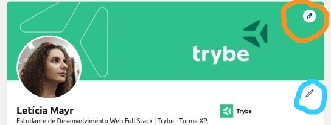  
_Há templates disponíveis no slack da Trybe que podemos usar e há também templates para linkedin no <a href="http://canva.com/">Canvas</a> (exemplo foto abaixo)_   
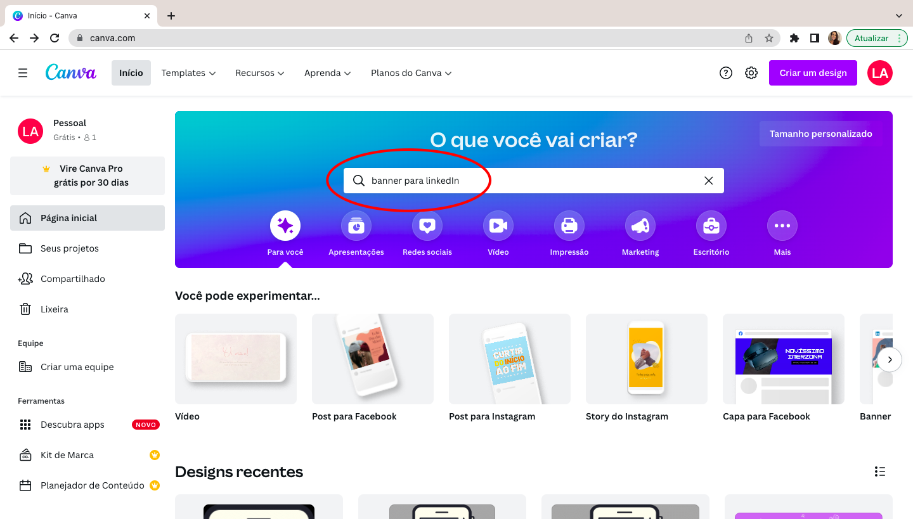  

#### :seedling: Uma ideia para o título é usar Estudante de Desenvolvimento Web Full Stack | Trybe - Turma XP. Basta digitar na área em vermelho e depois clicar em salvar.
  

## :seedling: Colaboradora: [Letícia Mayr](https://www.linkedin.com/in/leticia-mayr/) :green_heart:

<strong>Dia 2 :seedling:</strong>
 

# Desafio diário | Adicionar foto, nome, bio e localização 

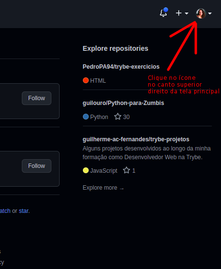  
  
  
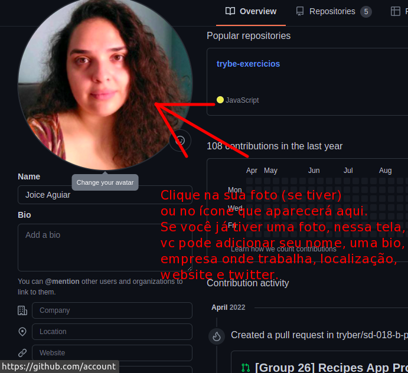  
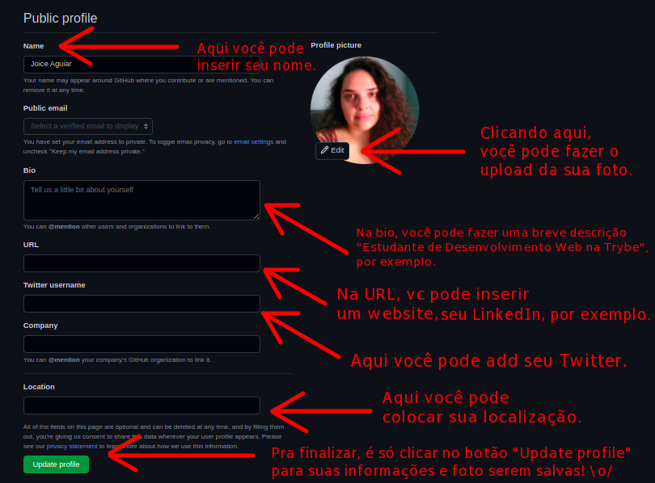  

## :seedling: Colaboradora: [Joice Aguiar](https://www.linkedin.com/in/joicemaguiar/) :green_heart:

<strong>Dia 3 :seedling:</strong>
 

# Desafio diário | Mudar o setor, formação acadêmica (introdução), localidade e contato 

## :seedling: Faça login, acesse o seu perfil e depois clique nesse lápis para editar sua introdução.
     
  

## :seedling:  Neste janela, você pode editar muitas coisas, inclusive gravar a pronúncia do seu nome (apenas pelo app) e também adicionar os pronomes aos quais usa (e abaixo você configura quem pode ver isso, recomendo deixar _Todos_ 

  

## :seedling:  Logo abaixo terá a opção de colocar onde você trabalha atualmente (caso esteja trabalhando) e também onde estuda (é importante ticar a opção Exibir minha formação na introdução para que fique aparecendo logo no início do perfil).

 
  

## :seedling:  Em seguida terá a opção de alterar sua localização.

  

## :seedling:  Quase finalizando, você pode atualizar o seu contato.

  

## :seedling:  Por fim, abrirá uma aba para inserir todas as informações pertinentes. Note que é onde pode fazer a personalização da URL, mas isso ficará para outro desafio.

 
## :seedling:  Após preencher todas as opções e escolher a forma de visualização para sua rede de contatos, é só clicar em salvar, após salvar, você será redirecionada para a sessão anterior e também precisará clicar em salvar. Após isso, mais um passo já foi finalizado no seu perfil.

  

## :seedling: Colaboradora: [Brenndha Cabral](https://www.linkedin.com/in/brenndhacabral/) :green_heart:

<strong>Dia 4 :seedling:</strong>
 

# Desafio diário | Como personalizar o README do perfil do Github 

 ## :seedling: Clique [aqui](https://www.youtube.com/watch?v=TsaLQAetPLU) e veja esse vídeo de 20 minutinhos (rapidinho :fire:) e você vai entender melhor como funciona o README do perfil e como personalizá-lo.

## :seedling: Colaboradora: [Brenndha Cabral](https://www.linkedin.com/in/brenndhacabral/) :green_heart:

<strong>Dia 5 :seedling:</strong>
 

# Desafio diário | Escrever o _Sobre_ do LinkedIn, seu texto de apresentação! 

 ## :seedling: Faça login, acesse o seu perfil.
     
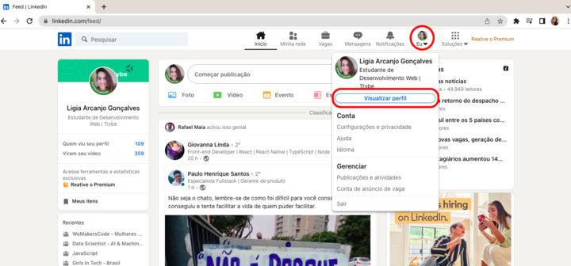  

## :seedling: Se não houver nenhum _Sobre_ no seu LinkedIn, faça os passos seguintes:
 - Vá até a opção _Adicionar seção do perfil_;
 - Abrirá uma caixinha, você deve selecionar a opção _Adicionar sobre_;
 - Escreva seu texto na área mostrada na terceira imagem e salve.

 
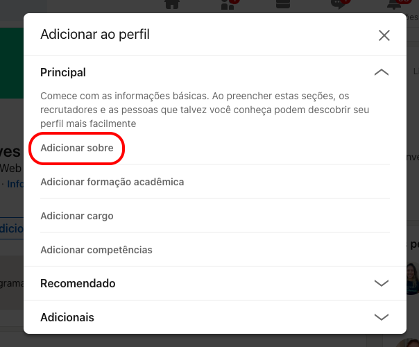 
  

## :seedling:  Se você  já tem um _Sobre_ e quer editar, faça os passos seguintes:
 - Vá até a seção _Sobre_ do seu perfil e clique no lápis para editar;
 - Abrirá uma caixa de texto, é só escrever o seu _Sobre_ e salvar.

 
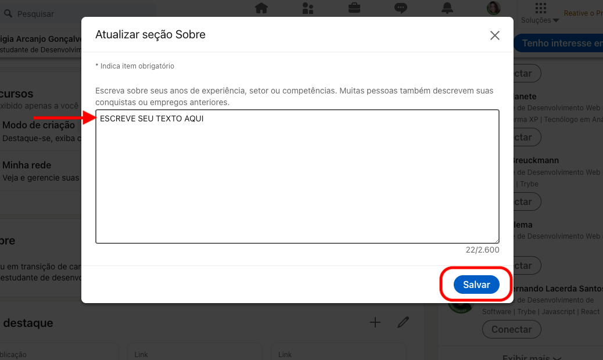  

## :seedling: E agora? O que escrever? Aqui vão algumas dicas:
 - Escreva uma breve apresentação sobre você;
 - Deve ser um texto pequeno e fluido;
 - Escreva em primeira pessoa;
 - Importante pensar em como você quer ser vista pelas pessoas;
 - Ideias para começar: Quais são suas paixões? Comunicar seus interesses; Linguagens de programação que domina; Qual é seu propósito?
 - Se estiver em transição de carreira, é legal falar qual foi sua motivação para fazer a transição.

 

:warning: **Importante:** É um texto sobre você! A ideia aqui não é ter uma receita de bolo para seguir a risca. Deve ser um texto autêntico, que faça sentido para você. E lembre-se: geralmente o _Sobre_ é a primeira coisa que o recrutador vai olhar no seu perfil.

 

## :seedling: Colaboradora: [Ligia Arcanjo Gonçalves](https://www.linkedin.com/in/ligiaarcanjo/) :green_heart:

<strong>Dia 6 :seedling:</strong>
 

# Desafio diário | Criando README do perfil [GitHub](https://img.shields.io/badge/github-%23121011.svg?style=for-the-badge&logo=github&logoColor=white)

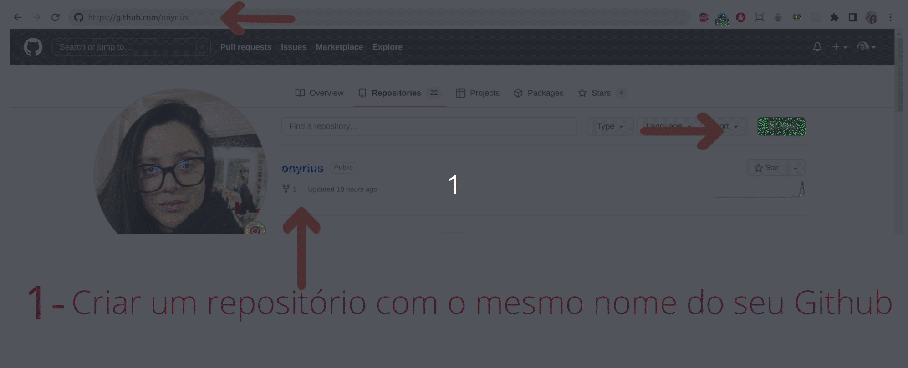  
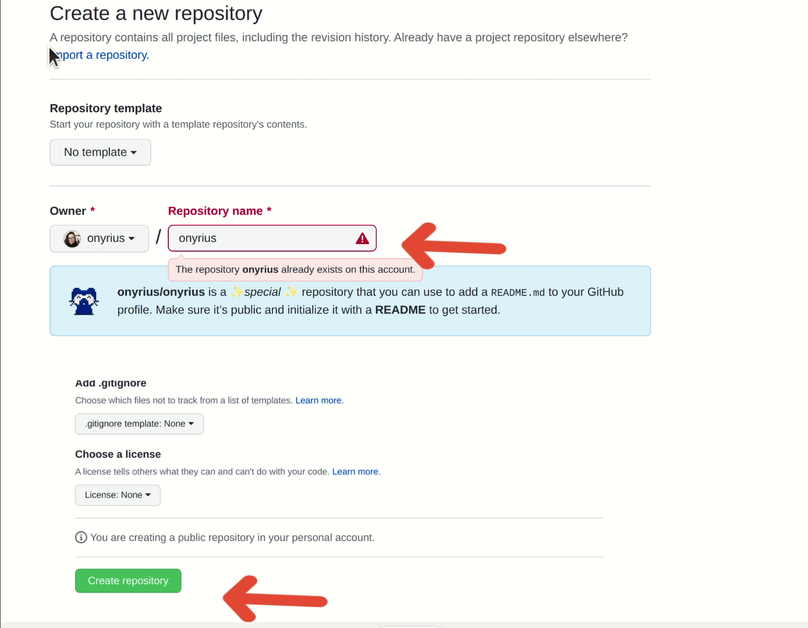  
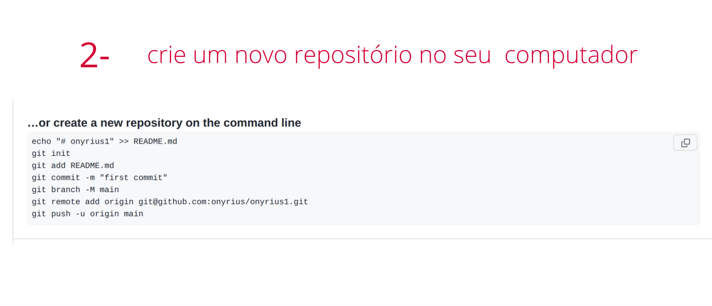  
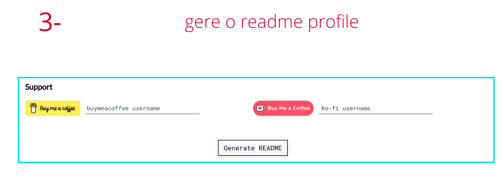  
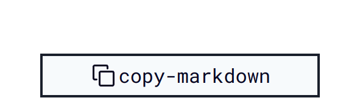  
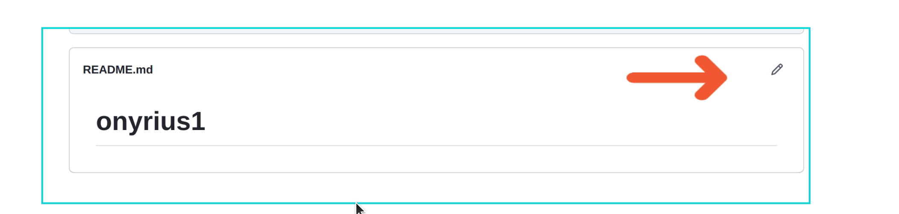  
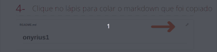  
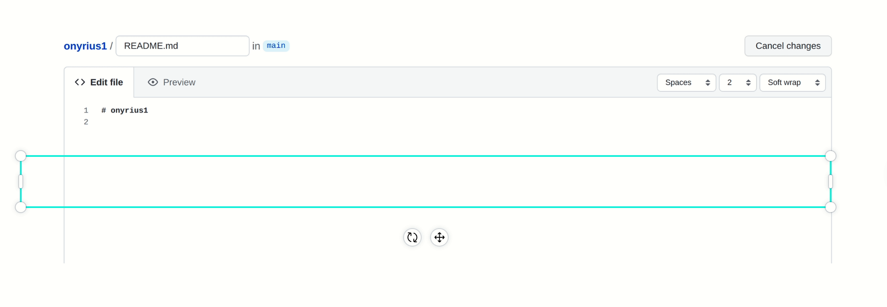  
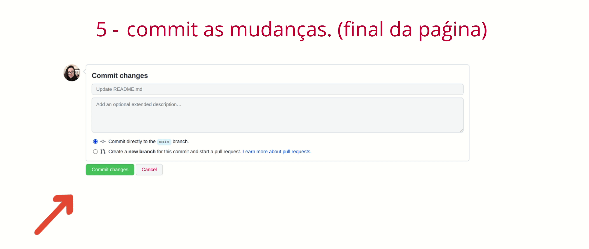  

## :seedling: Colaboradora: [Suelen Arruda](https://www.linkedin.com/in/suelen-arruda/) :green_heart:

<strong>Dia 7 :seedling:</strong>
 

# Desafio diário | Adicionar experiências profissionais 

Todas as experiências profissionais são válidas e devem ser incluídas no seu LinkedIn. Na descrição de cada experiência, você deve incluir suas principais atribuições e entregas em forma de tópicos, evitando parágrafos longos.
Além disso, adicionar mídias, deixam o seu perfil mais interessante.

Hackathons e projetos que você participou, também podem ser incluídos como experiências profissionais!
  

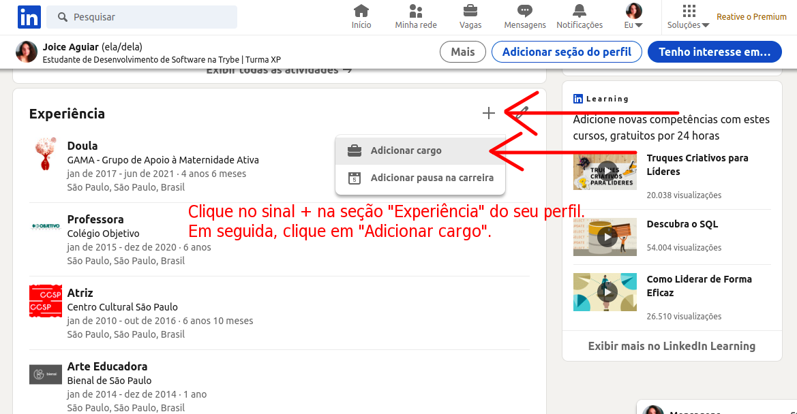  
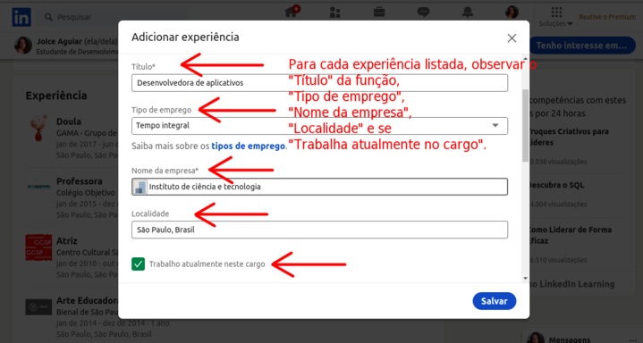  
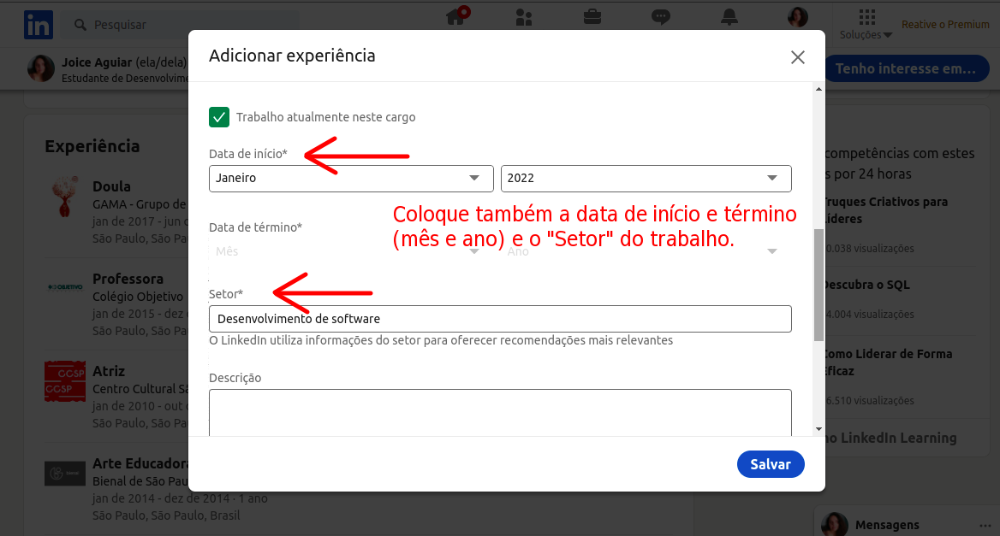  
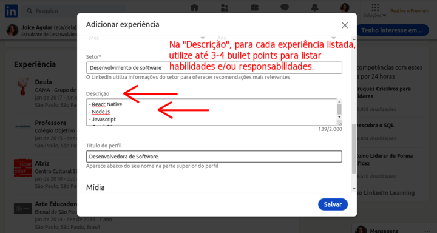  
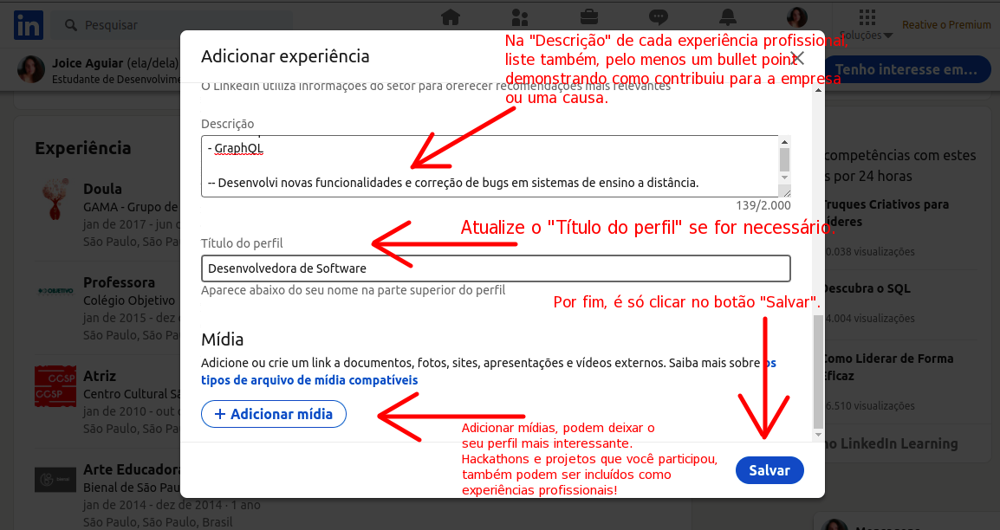  

 - Para cada experiência listada utilizar até 3-4 bullet points para listar habilidades e/ou responsabilidades;
 - Em cada experiência profissional listar, pelo menos, um bullet point demonstrando como contribuiu para a empresa ou uma causa;
 - Para cada experiência listada, observar o nome da empresa /organização, o título de função, data de início e término (mês e ano).

  

## :seedling: Colaboradora: [Joice Aguiar](https://www.linkedin.com/in/joicemaguiar/) :green_heart:

<strong>Dia 8 :seedling:</strong>
 

# Desafio diário | Adicionar as formações acadêmicas 

#### :seedling: Vá até seu perfil.   
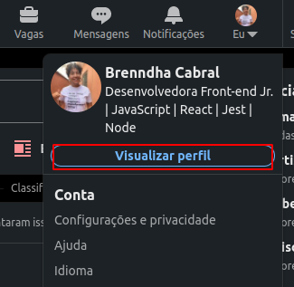  

#### :seedling: Role para baixo até chegar em Formação acadêmica (fica logo após os experiências profissionais).

_Clique em editar para editar alguma experiência profissional já inserida ou clique em adicionar para inserir uma nova experiência_

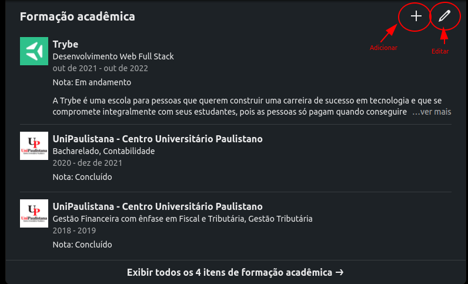  

#### :seedling: A seção de Formação acadêmica não aparece? Suba um pouquinho e clique em Adicionar seção do perfil  e adicione.

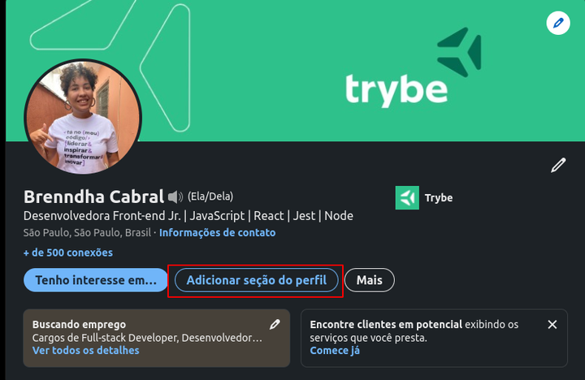  
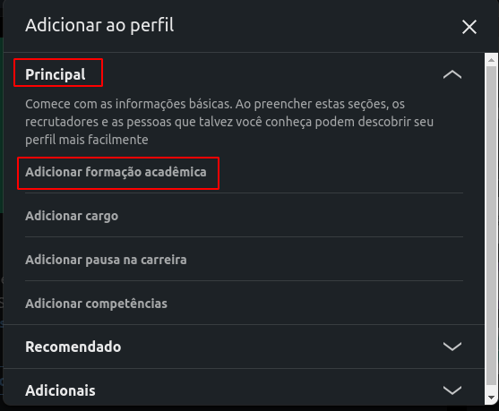  

#### :seedling: Para adicionar uma nova Formação acadêmica, pasta clicar no botão inserir (passo acima) e se abrirá essa janela onde é possível inserir todas as informações pertinentes. Lembrando que é possível adicionar alguma mídia então se houver algum link a documentos, fotos, sites, apresentações e vídeos externos é interessante anexar. Não esqueça em clicar em Salvar.

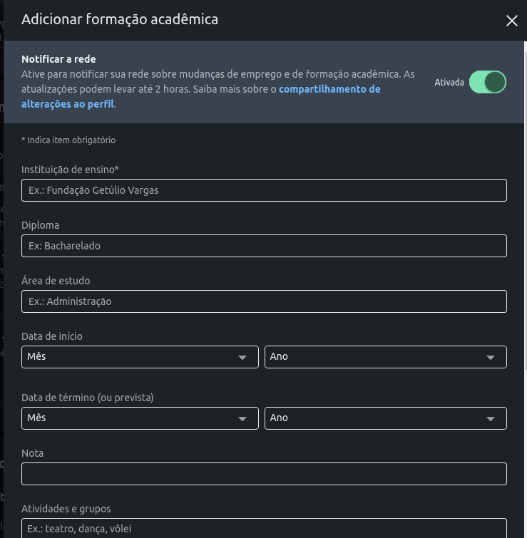  
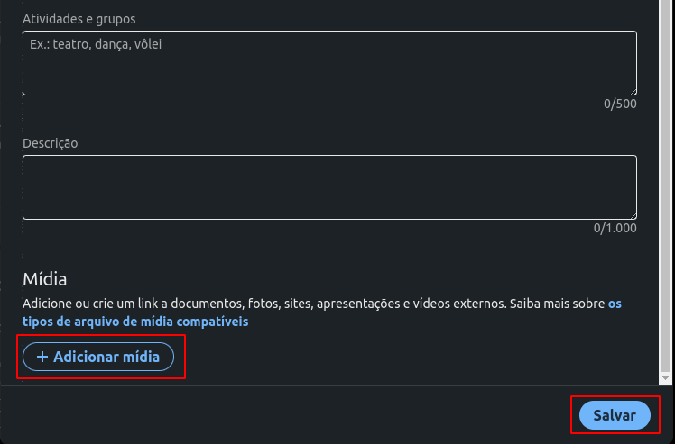  

#### :seedling: Quer adicionar uma nota ou excluir a Formação acadêmica? Só clicar no botão de editar (passo acima) que irá habilitar para você.

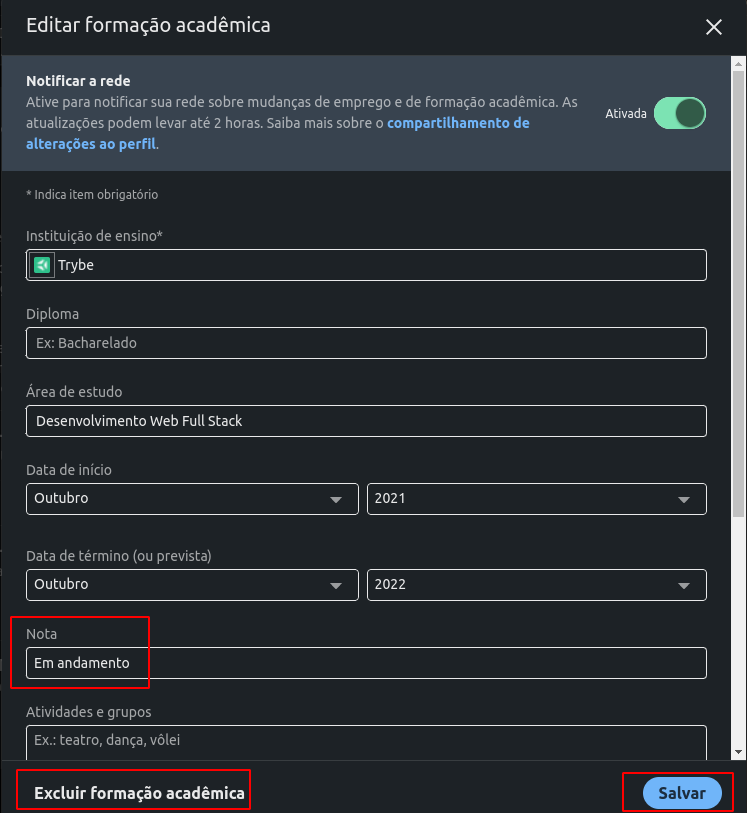  

## :seedling: Colaboradora: [Brenndha Cabral](https://www.linkedin.com/in/brenndhacabral/) :green_heart:

 

---
        
  #### :sos:   Precisa de ajuda? Procure-nos   :sos:

<a href="https://github.com/Alineol">Aline</a>

<a href="https://github.com/AngelicaCSSilva">Angélica</a>

<a href="https://github.com/brenndha-cabral">Brenndha</a>
       
<a href="https://github.com/Carolyla">Carol</a>

<a href="https://github.com/joiceaguiar">Joice</a>

<a href="https://github.com/LeticiaMayr">Letícia</a>  
 
 <a href="https://github.com/TabataSouto">Tabata</a> 
       
<a href="https://github.com/onyrius/">Suelen</a>
