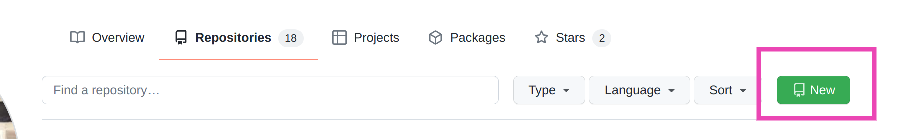
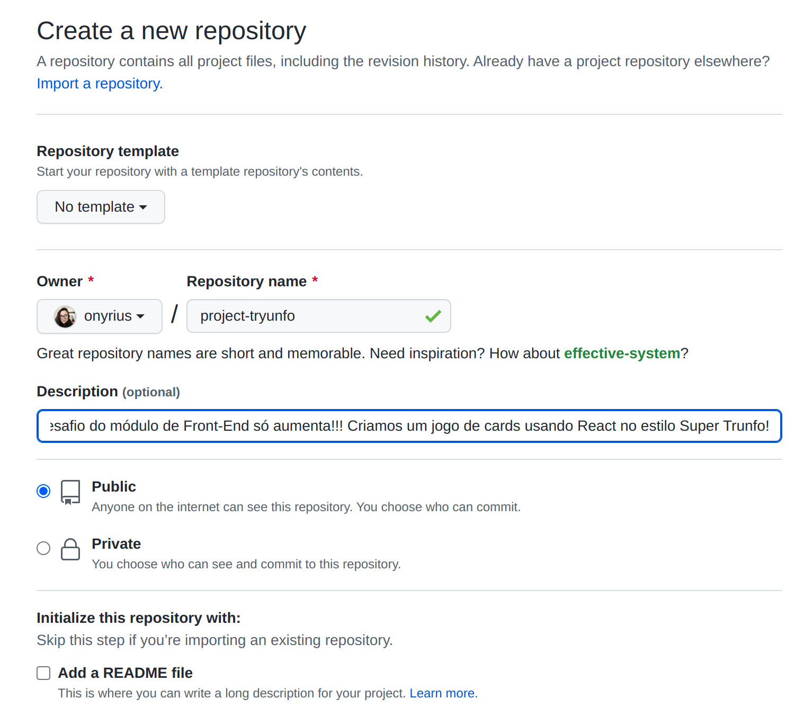
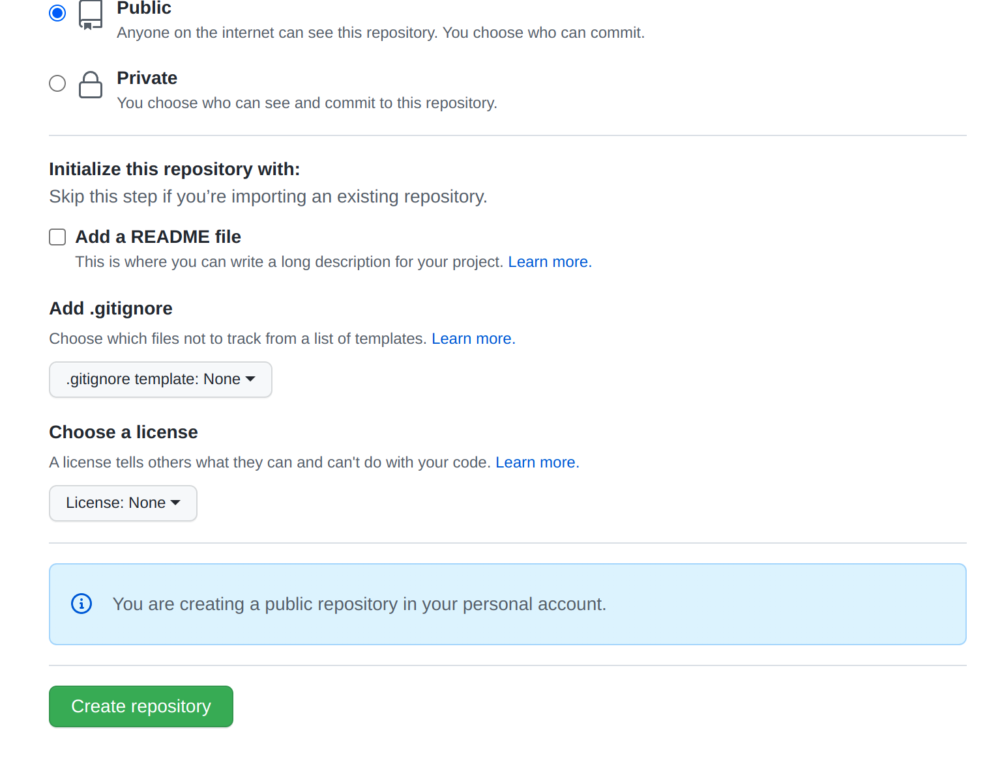
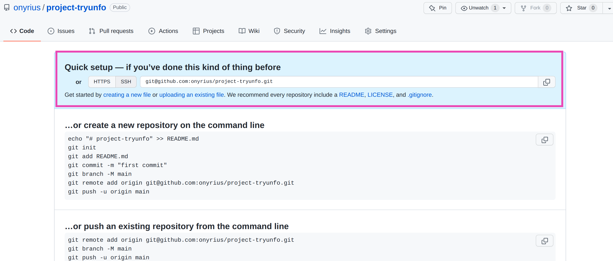
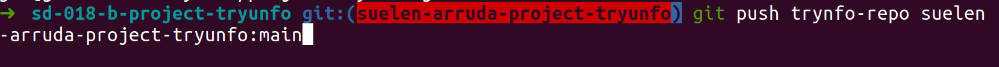
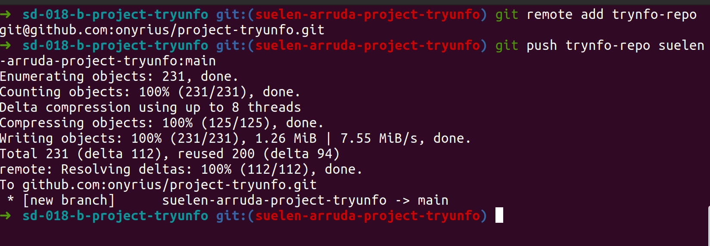

 
 #  :octocat:  Passo a passo para não perder os seus commits  :octocat:

 

### 1 - Criar um novo repositório no seu perfil do GitHub 

:exclamation: Clique no botão *"New"* logo no topo da página de seus repositórios como na figura a abaixo

 

---

 

:exclamation: Clicando no botão *"New"*, você será redirecionada para a pagina de criação. Preencha os campos requiridos e clique no botão verde "Create repository" que fica no final da página

 

---

 

:exclamation: **Você será direcionada para a seguinte tela (guarde o SSH )**

---

 

### 2 - Adicionar o seu repositório local ( branch que está o projeto da Trybe ) ao seu repositório criado

**Entre na sua branch do projeto da Trybe**

`git checkout <sua_branch>`

 

 

---

---

## :exclamation: :exclamation: Aviso da Trybe :exclamation: :exclamation:

_Importante : (ANTES DE DAR O PUSH PARA O SEU REPOSITÓRIO PESSOAL)
  Ajuste seu código para não ferir os Termos de Uso da Trybe ou o Manual da Pessoa Estudante :  
     :heavy_check_mark: Remova todos os testes da Trybe que avaliam os requisitos do Projeto, assim como arquivos e pastas auxiliares ao avaliador da Trybe ( trybe.yml , .github/* e .trybe/* ).  
     :heavy_check_mark: Edite o README apagando o conteúdo original ( depois preencha de acordo com nosso guia de README para projetos ! )  
     :heavy_check_mark: Se o Projeto não foi feito individualmente : garanta que as outras pessoas que contribuíram estão de acordo, dê os devidos créditos a elas no README , e também sinalize no README quais partes do código foram implementadas por você.  
     :heavy_check_mark: Se a Trybe forneceu uma aplicação (ou parte dela) no Projeto e você apenas precisou complementá-la para realizar requisitos ( exemplo: requisitos de implementações de testes ): sinalize no README quais partes do código foram implementadas por você, e quais foram fornecidas pela Trybe_
     
---

---

 

 

:exclamation: **- Faça os commits. E adicione do remote ao seu repositório local.**

`git remote add <apelido_do_remote> <url_ssh_do_repositório>`

:exclamation: **nesse caso, eu apelidei o meu remote de tryunfo-repo - como na imagem abaixo**

 

---

 

**depois faça o push do seu repositorio local para o  remote** 

`git push <apelido_do_remote> <sua_branch>:main`
 

 

 

---

##  checkered_flag:  Prontinho!!! Seu projeto já está dizendo "Olá, Mundo!"  checkered_flag:
